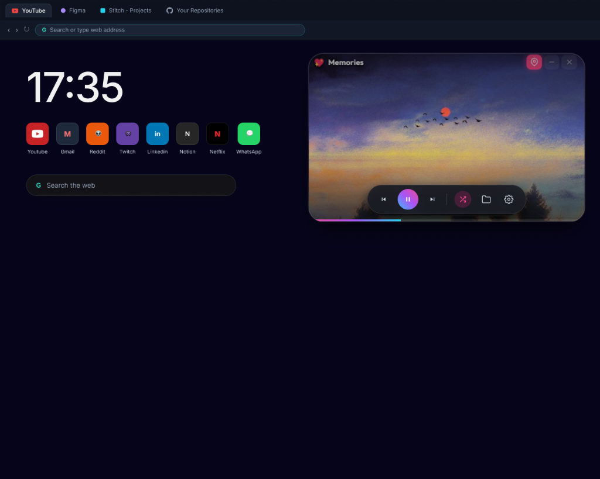
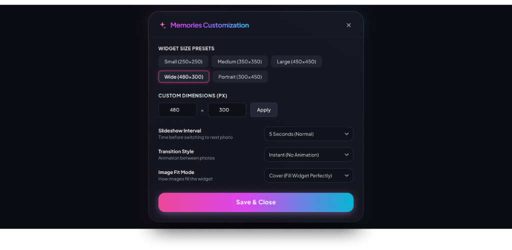

  
  <h1>📸 Memories</h1>
  
<b>A beautiful, modern desktop photo slideshow widget for Windows.</b>

  
  

    
    
  

## ✨ Overview

**Memories** is a sleek, glassmorphism-inspired desktop widget that lets you relive your finest moments right from your desktop. Just select a folder of your favorite photos, and let the widget cycle through them elegantly while you work.

It features a borderless design, customizable sizing, and intuitive hover controls, providing a premium experience that seamlessly blends into any Windows desktop environment.

---

## 🚀 Features

### Elegant Slideshow Experience
The widget provides a distraction-free, borderless viewing experience. Your photos take center stage with smooth crossfade and zoom transitions. 

- **Hover Controls**: A minimalist, translucent control bar appears only when you need it, letting you pause, play, shuffle, or skip photos.
- **Timer Progress Bar**: A subtle progress bar at the bottom indicates when the next photo will appear.

### Full Customization
Tailor the widget exactly to your preferences using the built-in settings panel.

  

- **Slideshow Interval**: Choose how fast or slow photos transition (from 3 seconds to 15 minutes).
- **Transition Styles**: Switch between Smooth Crossfade, Zoom & Fade, Slide Left, or Instant transitions.
- **Image Fit Modes**: Perfectly adapt photos to the widget using Cover, Contain, or Fill modes.
- **Widget Sizing**: Quickly resize using handy presets (Small, Medium, Large, Wide, Portrait) or specify exact custom dimensions.
- **Always on Top**: Pin the widget above other windows so your memories are always visible.

---

## 📥 Download & Usage (Portable Application)

**Memories** is a fully portable application, meaning there is **no installation required**. 

1. **Download the app**: Download this repository as a ZIP (or clone it) to any folder on your PC.
2. **Run it**: Double-click `Memories.exe` inside the folder to launch the widget.
3. **Start viewing**: Hover over the widget, click the settings icon, select your photo folder, and enjoy!

---

## 💻 Technologies Used

Built using **Electron**, **HTML5**, **CSS3**, and **Vanilla JavaScript** to provide a seamless native-like desktop experience.
